# AWS

#### 1. Region vs Availability Zone vs Edge location

+ Region: each region has many availability zone
+ availability zone: is one or more discrete data centers that are separate from each other so that they are isolated from disaster
+ edge location: smaller data center that hosts the web content

#### IaaS vs PaaS vs Saas

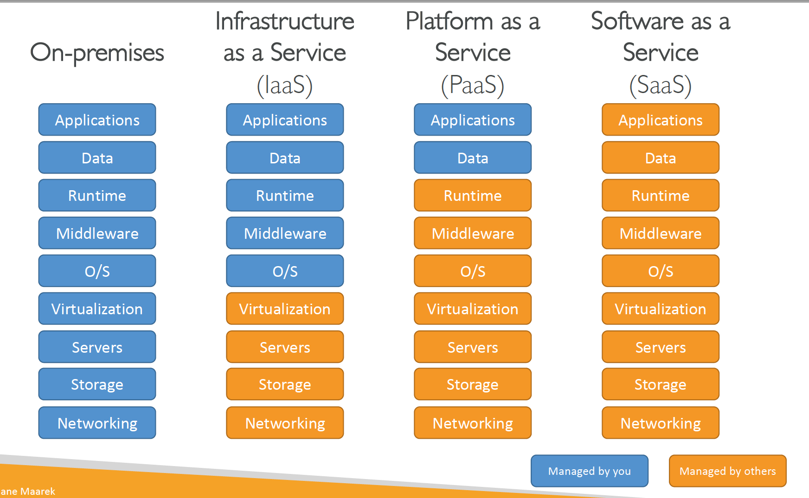

## IAM

#### Users and groups

1. <u>identity and Access Management</u>, **Global** service
2. Users dont have to be in a group, a user can be in multiple group
3. **dont use root account except for was account setup**

#### Permission

1. json documents policies
2. <u>least previlege</u>: no more permisson than user needs

#### Password Policy

length, special characters, change password periodically, not re use old password

#### MFA(Multi Factor Authentication)

MFA = password you know + security device you own

security alerts --> enable MFA or "my security credential" in the navbar

we can <u>enforce</u> user to use MFA by creating new policy.

#### Access AWS

+ managment console
+ command line interface (CLI)
+ software developer kit SDK

#### IAM Roles

Assign permission to entities you trust, **normally not for physicall users**, but to other services that need to take action on your behalf such as allow EC2 instance access AWS.

#### IAM Security Tools

+ <u>Credential reports</u> (account level): lists all your accounts' users and the status of their various credentials
+ <u>Access Advisor</u> ( user level): shows service permissions granted to a user and when those services were last accessed

### Summary

• **Users**: mapped to a physical user, has a password for AWS Console

• Groups: contains users only

• **Policies**: JSON document that outlines permissions for users or groups

• **Roles**: for EC2 instances or AWS services

• **Security**: MFA + Password Policy

• **Access** Keys: access AWS using the CLI or SDK

• **Audit**: IAM Credential Reports & IAM Access Advisor

## EC2

#### Classic Ports to know

• 22 = SSH (Secure Shell) - log into a Linux instance

• 21 = FTP (File Transport Protocol) – upload files into a file share

• 22 = SFTP (Secure File Transport Protocol) – upload files using SSH

• 80 = HTTP – access unsecured websites

• 443 = HTTPS – access secured websites

• 3389 = RDP (Remote Desktop Protocol) – log into a Windows instance

#### EC2 instances Purchasing Option

+ **On-Demand**: pay for what you use, highest cost but no upfront payment, no long term commitment
+ **Reserved**: commitment, **only two options:**  one year and three years, 
  + Reserved Instances: fixed type instance
  + Convertible Reserved Instance: flexible instances types
  + Scheduled .. : specific period of time, ex: only use every Saturday from 1 am to 2 am 
+ **Spot**: changes over time, you may lose it.
+ **Dedicated Hosts**: EC2 Dedicated Host is a physical server with EC2 instance capacity fully dedicated to you use. **compliance requirement** and **use your existing server-bound software license**
+ **Dedicated Instance**: instance runningon the hardware that is dedicated to you

## EC2 Storage 

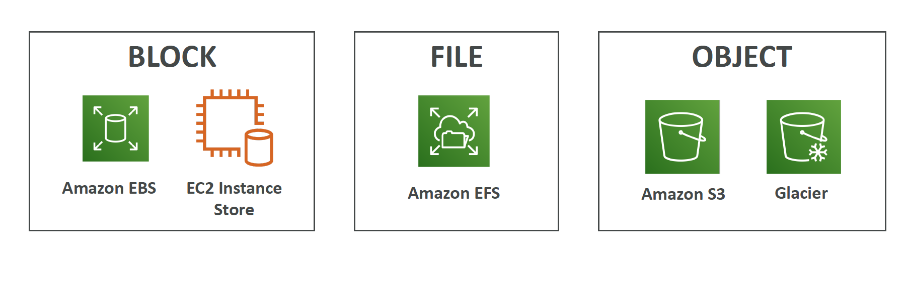

#### EBS Vloume

+ **Elastic Block Store**
+ it is a network drive that can be attached to instance, not a physical drive, it use network to communicate the instance, some lag
+ **it can only be mounted  on one instance at a time**, but one stance can have more than one EBS
+ <u>bound</u> to specific availability zone, EBS from zone A cannot be used for Zone B, unless use **snapshot**
+ **Snapshot**: make a backup of EBS (with data )and copy it across AZ or region or create a new volume based on the snapshot in different AZ or region
+ like a usb stick

#### EC2 Instance Store

+ Local
+ higher performance, better I/O performance
+ not for long term storage, it loses all  storage if instance is terminated
+ better to back up

#### EFS

+ Elastic File System
+ can be mount on **multiple EC2** at the same time
+ only with **Linux system**, but with **multi-AZ**

## EC2 AMI

+ Amazon Machine Image
+ it is a customization of an EC2 instance, we can add our own software, configuration, operating system,...
+ it **provides requirements** to set up and launch EC2, more like lock.json file in node.js, like a **template**
+ it created for specific region and can be copied to other region
+ Example: we have a instance A, then we generate a AMI (more like template requirements.txt), and create a new instance B based on AMI, so two instances A and B share same configuraion

#### EC2 Image Builder

it automate the creation, maintain, validate and test EC2 AMIs. Free and can be run on a schedule

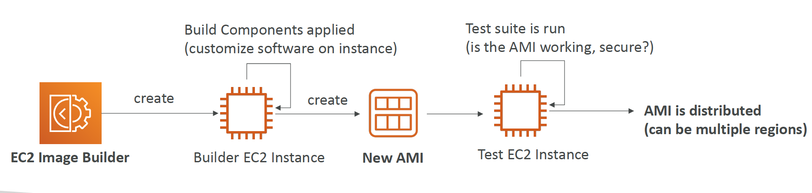

## ELB & ASG - Elastic Load Balancin & Auto Scaling Groups

#### Scalability & High Availability

* **scalability**: an application/system can handle greater loads by **adapting**. Ability to accommodate a larget load by making the hardware strong (scale up), or by adding numbers (scale out)
* two types of scalability: 
  * <u>vertical</u>: increase size of instance
  * <u>Horizontal</u>: sames as **Elasticity**, increase number of instances, distributed system
* **Elasticity**: once a system is scalable, elasticity means that there will be some "au**to-scaling**" so that they system can scaled based on the load
* **Agility**: not related to scalability, reduce the time to make resources available to your developer from weeks to just minutes
* **High availability** : running application at least two different AZ, in case one of the AZ is down.

#### Loading balancing

forward traffic to multiple servers (EC2 instance) across **multiple** A zones

* Hide instances and provide single entry point
* hide failure from users
* stop send the traffic to bad instance, and redirect the traffic to the good ones

**Types**:

+ Application load balancer (HTTP/HTTPs)
+ Network (TCP), high performance
+ IP
+ Classic

#### Auto Scaling Group

Scale out to match an increased load and scale in to match a decreased load, **automatically** register new instances to a load balancer, **replace** unhealthy instances

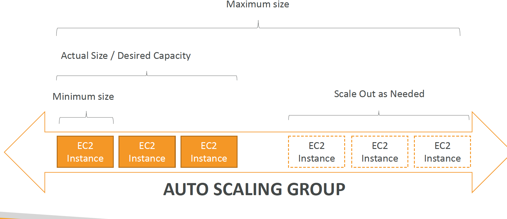

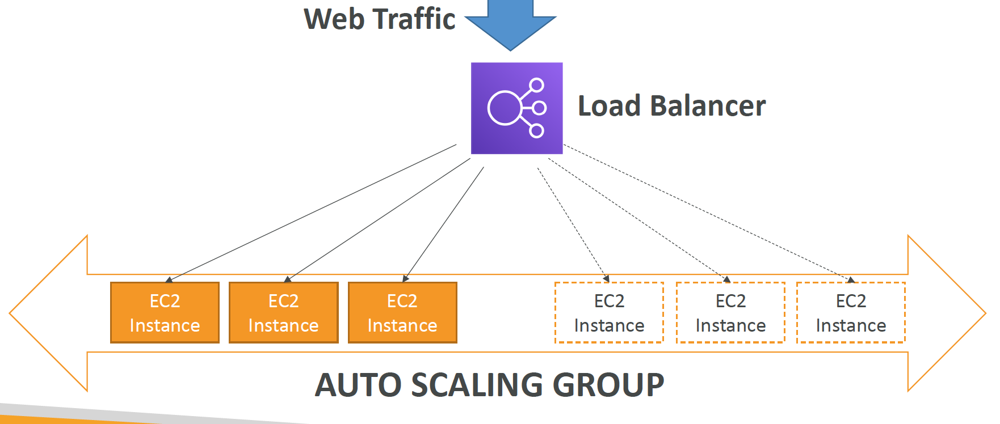

## Amazon S3

+ is one of the main building blocks of AWS, "infinitely scaling" **storage**.

#### Bucket(directory): 

+ name has to be **globally unique,** but **created at region level.** 
+ **key** is the full path, s3://my-bucket/<u>my_folder/something/something.txt</u>, underlined part is the key
+ **no concpet of "directory",** interface tricks you.
+ object larger than 5TB, it has to be in **multi-part** format

#### S3 Website

S3 can host static website, the url is `<bucket-name>.s3-website-<AWS-region>.amazonaws.com`. Enable the "static website hosting" in the property section

#### S3 Versioning

roll back and back up

#### S3 Access Log

Another bucket to store all logs of the bucket

#### S3 Replication

Copy is asynchronous, it needs versioning of both buckets enabled.

it is under "**management**" section in the bucket , create replication rule.

Object before enabling replication is not replicated

#### S3 Storage Classes

Durability, availability, it can be chose under "**storage class**" section when upload file.

+ **Standard**: general purpose
+ **Standard-Infrequent Access**: less frequent access, but low latency when access, lower cost, but charge retrieval fee. good for back up
+ **Intelligent -tiering**: low latency and better performance than S3 standard, **cost-optimized** by automatically moving between two tiers, if object is access frequently, it move objects to standard tier, other wise to infrequent tier
+ **One zone**: only store in one AZ, less resilience to disaster
+ **Glacier**: meaning object stored there **frozen for long time**, low cost for long term archiving/back up
+ **Glacier Deep Archive**: cheapest, but even longer time needed to retrieve.

#### Object Lock & Glacier Vault Lock

+ **Object lock**: adopt WORM (write once read many) model, block an object version deletion for a specified amount of time
+ **vault lock**: same as object lokc, the lock policy preventing future edits, **no longer** be changed

#### Snow Family - large scale data transport

Highly-secure, protable **off line** **devices** to collect an nd process data at the edge and **migrate** data into and out of AWS. 

if it takes more than a week to transfer, use snowball device

Through **physical route: shippment**

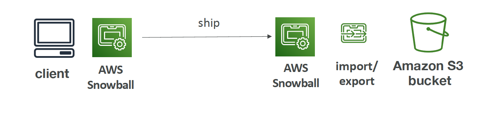

+ **snowball Edge**: physical data transport solution: move TBs or PB sof data,

+ **snowcone**: smaller device than snowball edge iin both size and capacity, 8TB, two options: ship back or AWS sync
+ **snowmobile**: truck size, 100PB capacity, 1 EB = 1000PB =1000,000 TB

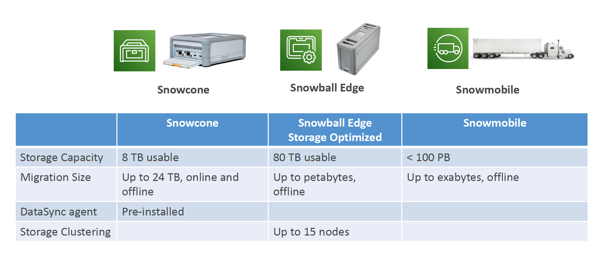

**Edge location**

where limited internet or computing access: preprocess data, machine learning. Two options: **Snowball** **Edge** and **snowcone**, both of devices run EC2 instance and AWS lambda function, **AWS OpsHub** a user interface use snow family 

#### AWS Storage Gateway

a **bridge** between **on-premise** data and **cloud data**, alow on-premises to seamlessly use AWS cloud

#### Summary

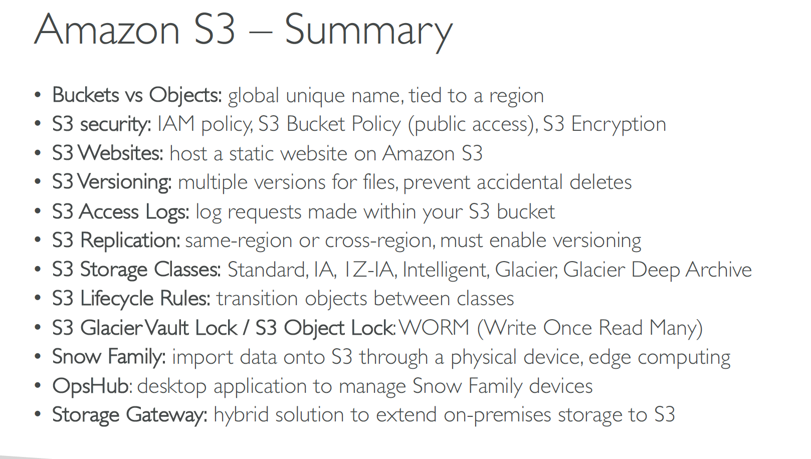

## Database

+ **Why**? structure, indexes to efficiently query/search, relationships

#### AWS RDS

+ can be free
+ Relational Database Service
+ It is **managed**( by AWS) DB service
  + Automated provisioning, OS patching
  + backup and restore
  + monitoring
  + multi AZ
+ Can't SSH into your instances (Database) ????
+ Share database

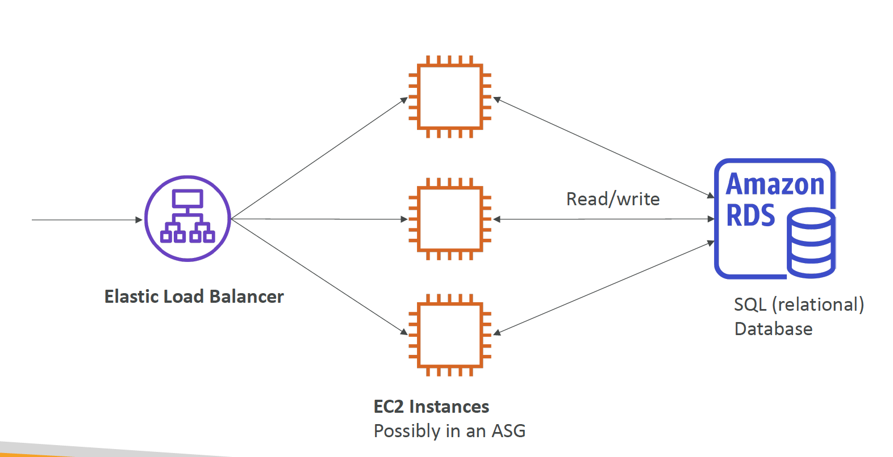

#### RDS, Read replica, Multi-Az, Multi-Region

+  **Read replica** 

  + **Purpose**: scalability
  + if there are more read request, we can scale the read workload of DB by making copies (replicas) of DB, to distribute the query request load.
  + Data only written into main DB
  + up to 15 replicas

  

+ **Multi-AZ:** 

  + **Purpose**: high availability
  + Failover in case of AZ outage(high availability)

  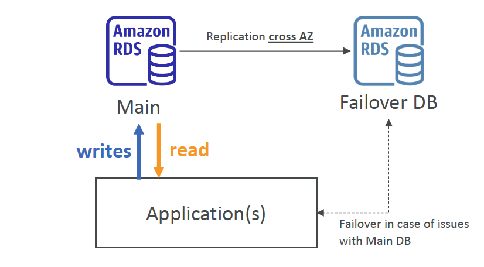

+ **Multi-Region**

  + **purpose**: Disaster recovery && local access give less latency

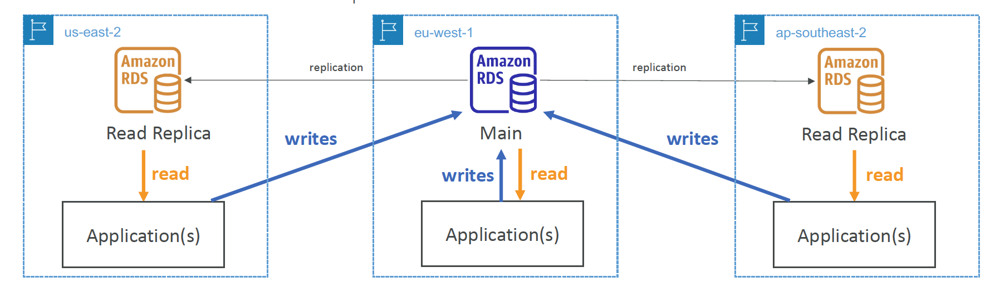

#### AWS Aurora

+ **not in free tier at all**
+ Same structure as RDS, SQL
+ not open source
+ **AWS cloud optimized**, better performance than RDS
+ storage **automatically grow up** in 10GB
+ **costs more**

#### Amazon ElastiCache

+ in memory
+ Managed
+ Reduce load off databases for read intensive workload

#### DynamoDB

+ Fully **managed** across **3 AZ**
+ **NoSQL**
+ scalable for massive workload, "**serverless**" (actually there is a server but it is hided)
+ Low **latency**
+ low **cost**, auto scaling

#### DynamoDB Accelerator - DAX

+ similar with **ElastiCache,** it is fully **managed** in **memory** cache
+ **only** for dynamo DB

#### Redshift

+ based on PostgresSQL, it is for **OLAP** (online analytical processing, analytics and **data warehouse**). instead of **OLTP** (online transaction processing, **CRUD** data)
+ Load data once every hour not every seconds
+ **Columnar** storage (not row based)
+ Massively parallel Query execution (**MPP**)

#### Amazon EMR

+ stands for "Elastic MapReduce"
+ helps creating  **Hadoop clusters (big data)** to analyze vast amout of data, and take care of all **provisioning** and configuration
+ Made of hundreds of EC2 instances
+ integrated with **Spot instance**
+ Data processing, big data, machine learning

#### Athena

+ **Serverless**, SQL
+ pay per query

#### QuickSight

+ **serverless** machine learning - powdered business intelligence service to create interactive dashboards

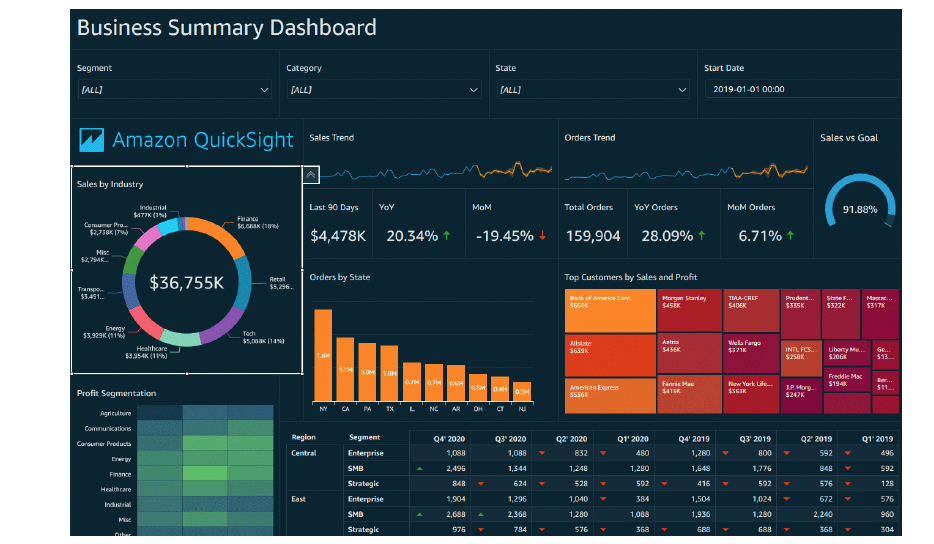

#### DocumentDB

+ is AWS implementation of MongoDB

#### Neptune

+ managed **graph** database

+ fraud detection, computer vision

#### QLDB

+ Stands for Quantum Ledger Database

+ store **history of all changes made to database**

+ **Immutable**, cannot be remove and modified

+ **centralized**  **Blockchain** DB

  

#### Amazon Managed Blockchian

+ Decentralized Blockchain

#### DMS Database Migration Service

+ source database is still available during the migrations
+ **Homogeneous** migrations: ex: Oracle to Oracle
+ **Heterogeneous** migration: ex: MS to Aurora

#### Glue

+ managed extract, transform, and load (ETL) service
+ Prepare and transform for analytics
+ Serverless 

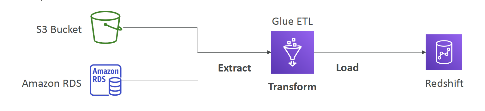

#### Summary

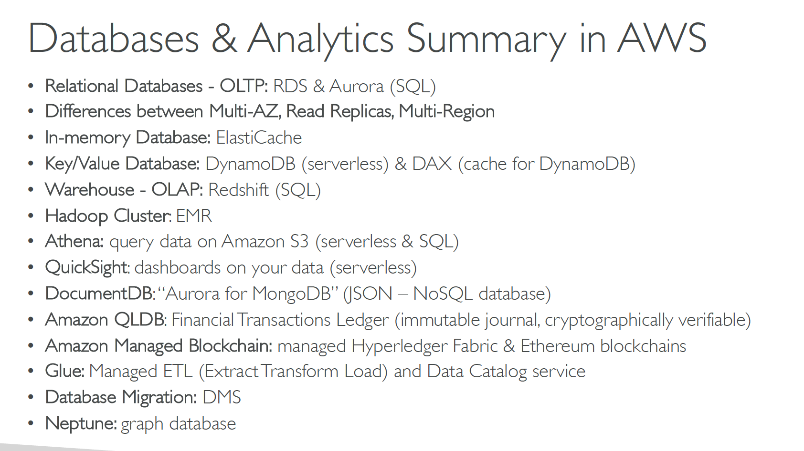

## ECS, Lambda, Batch, Lightsail

#### what is docker?

+ a software development **platform** to deploy apps

+ Apps are packaged in containers that can be run on **any OS**

+ Apps run the same, regardless of where they are running

+ easy and fast **scale** up and down

  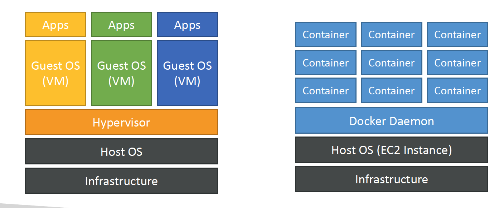

  

#### ECS, Elastic Container Service 

+ Help run container on AWS
+ **We** need to provision the infrastructure (EC2 instance)

#### Fargate

+ similar with ECS, but **no need to provision** infrastructure
+ **serverless** offering

#### ECR, Elastic Container Registry

**Where** to store container image

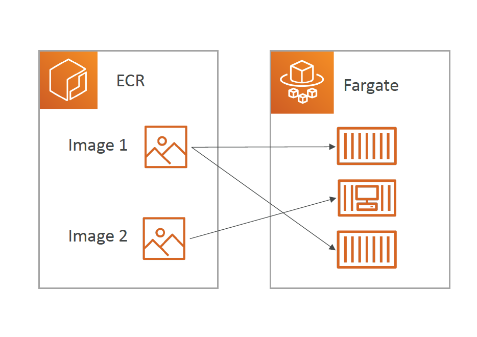

#### Serverless

+ actually there are servers, but developers do not need to manage servers
+ Function as a Service (**FaaS**)

#### Lambda

+ allows you to run a piece of code in the cloud when needed
+ **Event-Driven**
+ **Cheap**, costs are based on **calls** and **duration**
+ Only pay when lambda is triggered
+ auto **scale**

*Thumbnail: smaller version of the image*

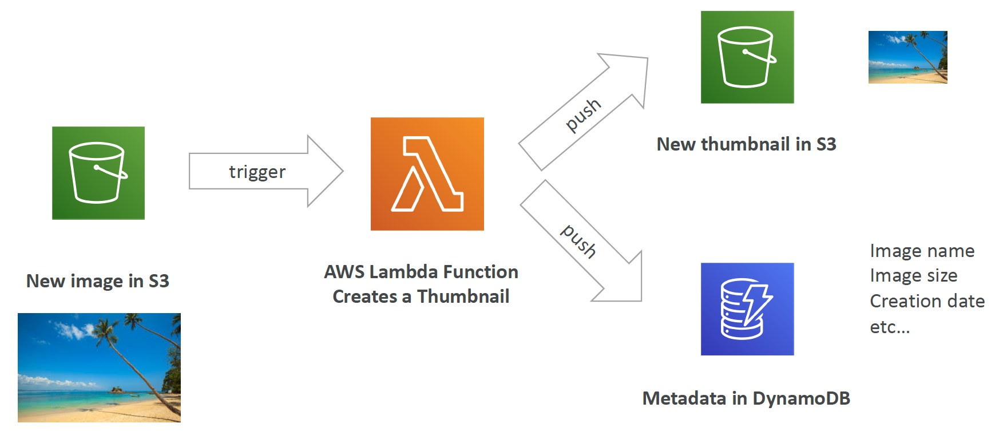

#### Amazon API Gateway

+ in the case below, API gateway expose the endpoint of Lambda

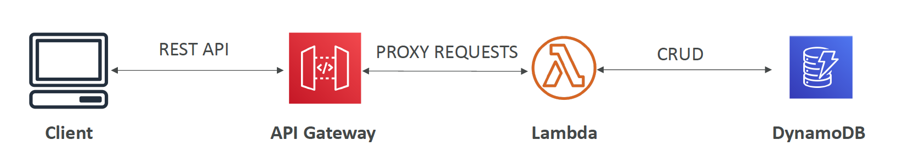

+ fully managed service for developers to easily create, publish, maintain, monitor and secure APIs

#### AWS Batch

fully managed **batch** processing service

It will provision **right** amount of compute to run batch jobs, which is cost efficient

In the case below, AWS batch will create EC2 instance, and stop it when batch job is done

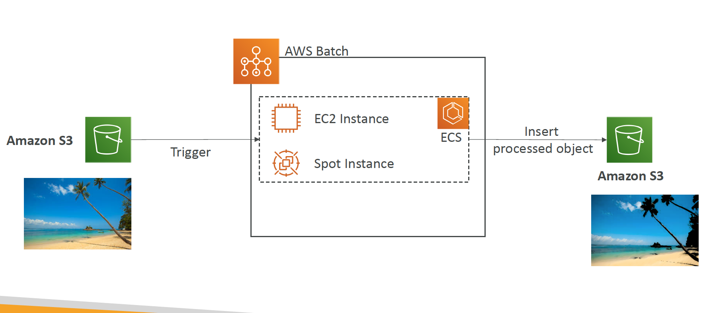

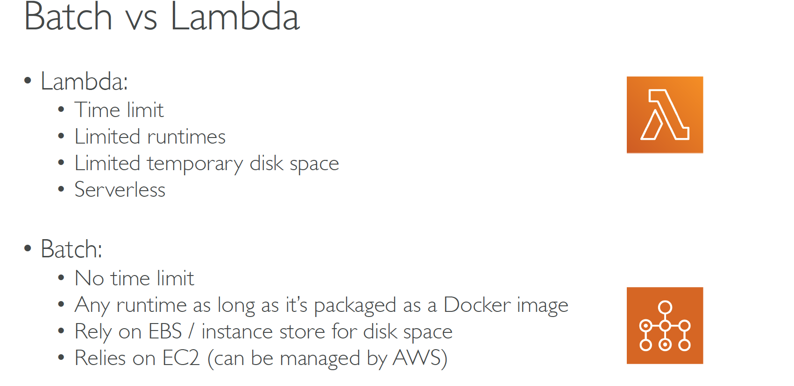

#### AWS Lightsail

+ more like independet service from AWS, it has virtual servers, storage, databse and networking by itself

+ Low price

+ simpler alternative to useing EC2, RDS, ELB, EBS...

+ for people with no cloud experience

  

#### Summary

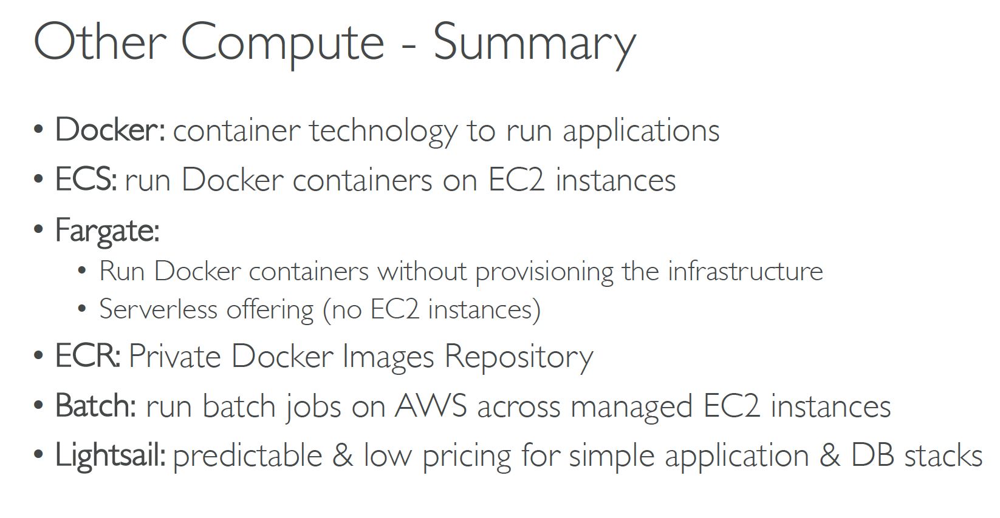

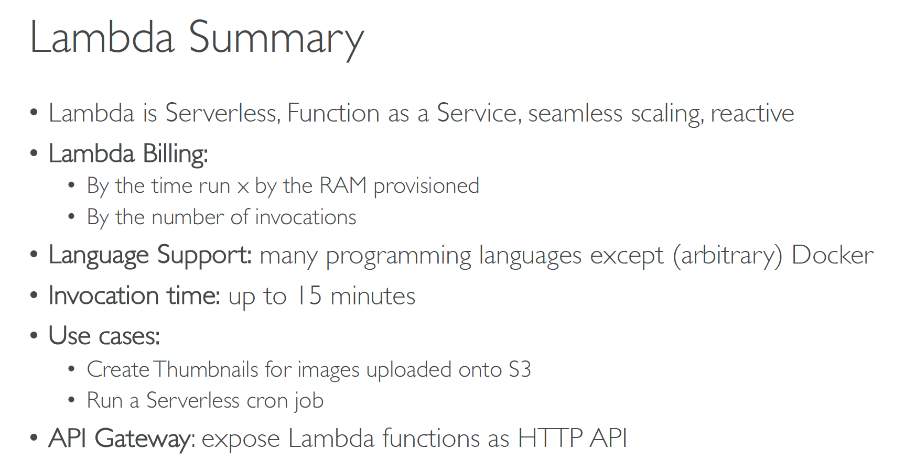

## Deployment and Managing Infrastructure at scale

### CloudFormation

+ **Declarative** way to create AWS infrastructure, instruction to config AWS infra 

+ for Example: in a CloudFormation template:

  • I want a security group

  • I want two EC2 instances using this security group

  • I want an S3 bucket

  • I want a load balancer (ELB) in front of these machines

+ then CloudFormation creates those for you in the right order with exact configuration that you specify
+ **Infrastructure as Code**, instead of manually do it through interface, excellent for contorl
+ **saving cost**, delete and recreate, estimate cost based on the CloudFormation template

+ productivity
+ it creates all resouces and relations among them for you.

### BeanStalk(set up infra for you)

+ Web App 3-tier

  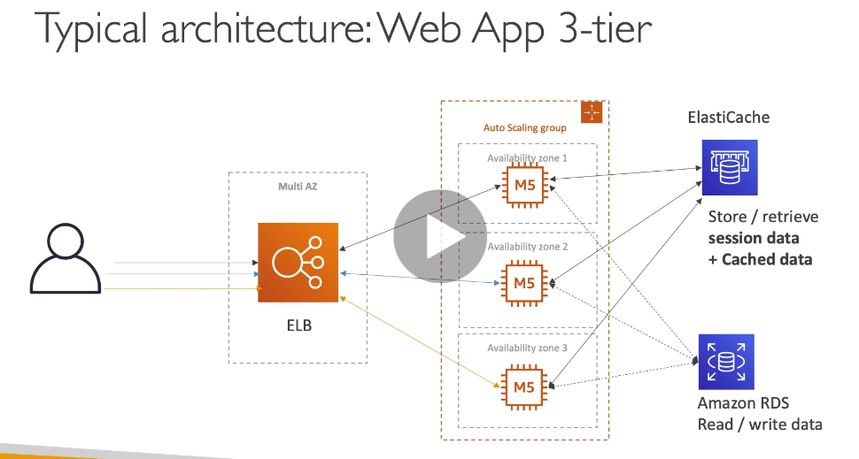

  

+ it uses all the component we have seen before: EC2, ASG, ELB ..
+ **PaaS**
+ **Three architecure models**
  + single instance : good for dev
  + LB + ASG: great for production or pre-production
  + ASG only, good for non-web apps
+ **Health monitoring**

### AWS CodeDeploy

+ upgrade versions of code
+ works with EC2 and On-premises, **hybrid** service

### AWS Commit

+ AWS version of GitHub 

### AWS CodeBuild

+ **build code on the cloud**
+ code can be compiled on cloud

### AWS CodePipeline

+ used to connect CodeCommit with CodeBuild

+ Basics for **CICD** (<u>continuous Integration & continuous delivery</u>): every time the code is commited and pushed to the repo, code is build. Tested , provisioned and deployed automatically

  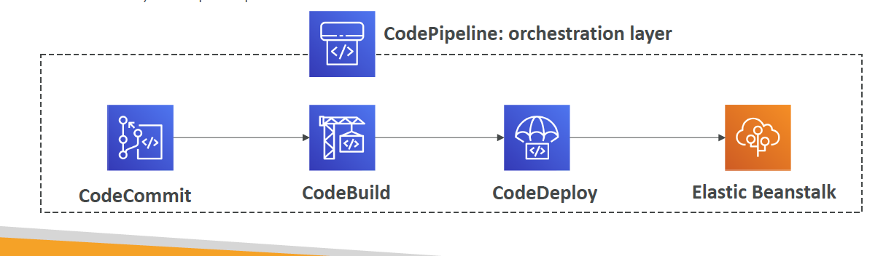

### AWS CodeArtifact

+ **Artifact management** stores and retrieves code **dependencies**
+ CodeArtifact is a secure, scalable and cost-effective artifact management services.
+ works with Maven, npm, yarn, pip ...
+ developer and codeBuild can retrieve the dependencies from codeArtifact directly

### CodeStar

+ unified UI to easily manage software development activities in one place 

### Cloud9

+ cloud **IDE**
+ can edit code in the cloud

### SSM(AWS System Manager)

+ help you manage EC2 and on-premise on the scale

+ **Hybrid** service

+ Important feature:

  + **patching** automation
  + run commands across an entire fleet of servers

+ works for **windows and linux**

+ need to install SSM agent in the instances

  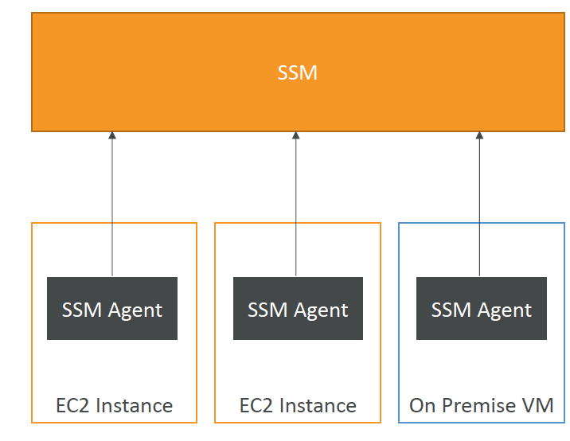

 

### AWS OPsWorks

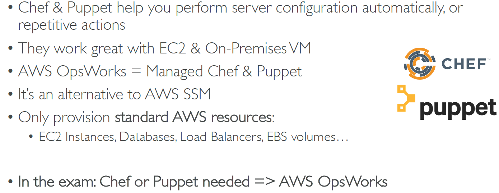

#### Summary

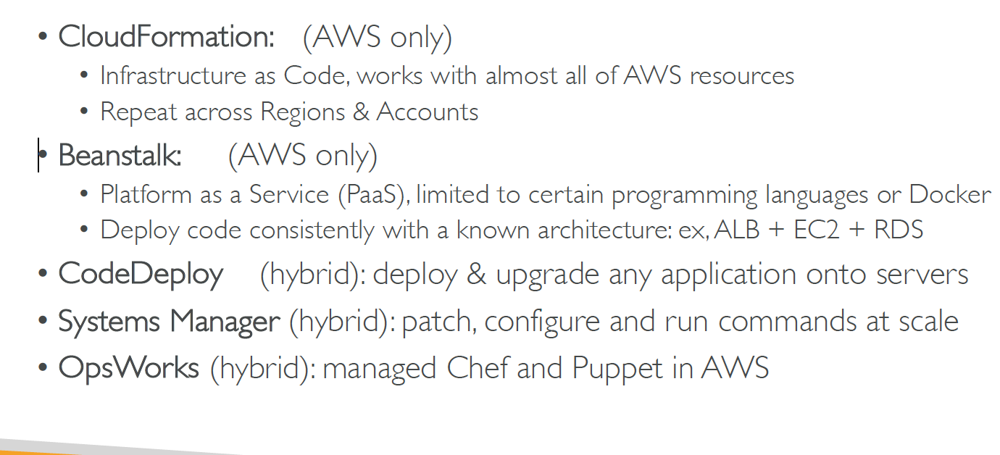

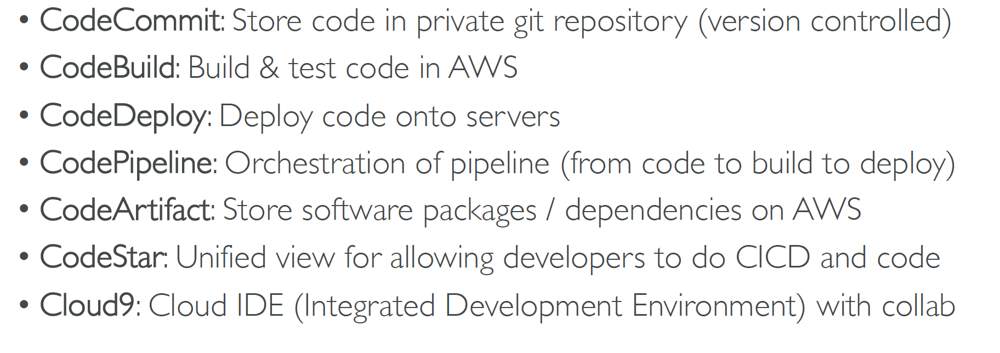

## Global Infrastructure Section

### global application

+ an application deployed in multiple geographies, for AWS, different Region or Edge location
+ decreased latency
+ disaster recovery
+ attack protection (hack)

### Global infrastructure

+ Regions: for deploying applications and infrastructure
+ AZ: made of multiple data centers
+ Edge locations: for content delivery as close as possible

### Global Applications in AWS

#### Global DNS: Route 53

+ route users to closest deployment with least latency

+ disaster recvoery

+ routing policies:

  + Simple routing policy, **no** health check

  + Weighted routing policy, like ALB (application load balance), **health check**

    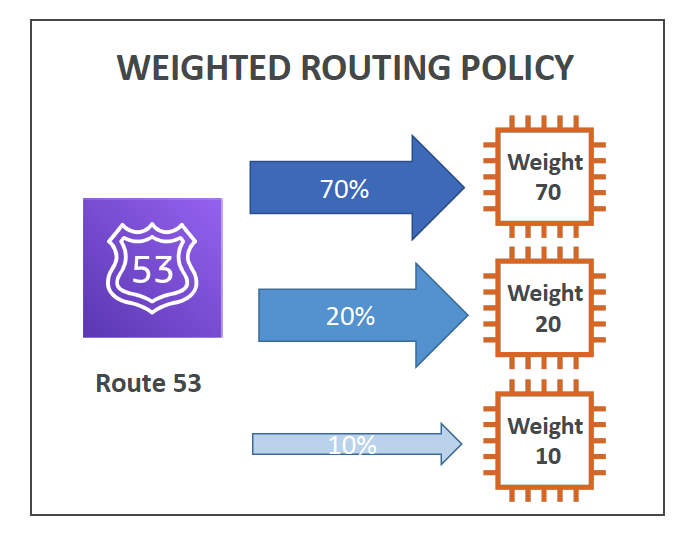

  + Latency routing policy, **health check**,choose server based on latency between users and server

  + failover routing policy, do **health check** , if one server fail, then rest of them will be used

### Global Content Delivery Network (CDN): CloudFront

+ replicate part of your application to AWS Edge locations, decrease latency

+ **cache** common requests, improved user experience and **decreased latency**

+ DDos protection

+ integrated with Shield and AWS Web Application Firewall(WAF)

+ CloudFront vs S3 replication

  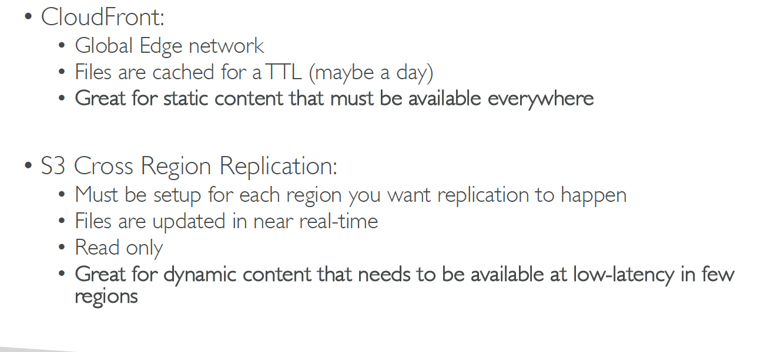

#### S3 Transfer Acceleration

+ accelerate global uploads & downloads into Amazon S3

+ good for uploading file to the s3 bucket which far way from you, the private connection between edge locations and s3 bucket is faster

  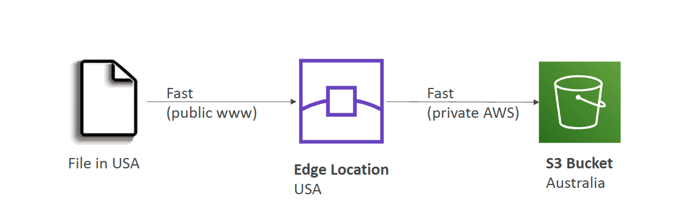

#### AWS Global Accelerator

+ improve global application availability and performance using the AWS global network

+ use **AWS internal network** to route the data transfer, instead of using public network

  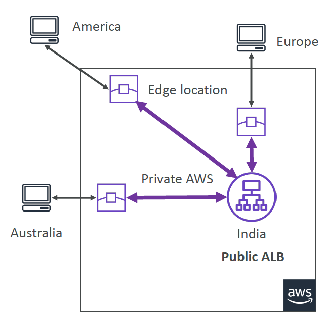

#### AWS Global Accelerator vs CloudFront

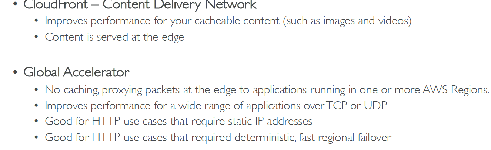

#### AWS OutPosts

+ server racks that allows the on-premise infrastructure uses AWS cloud service.
+ it will be physically installed on site
+ You are responsible for the physical security of the server racks

#### 	Summary

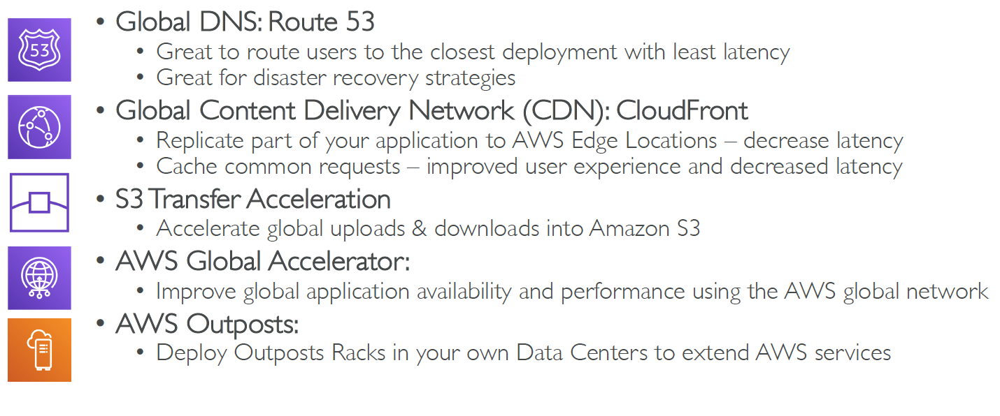

## Cloud Integrations

### two patterns of application communication

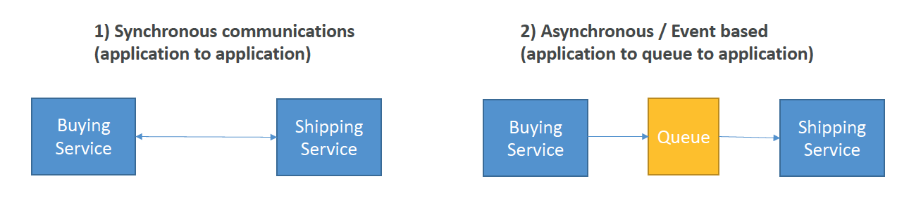

**Problem** for **Synchronous** can be **problematic**, if there are sudden spikes of traffic

then it is better to decouple your applications:

+ SQS, queue model
+ SNS: pub/sub model
+ Kinesis: real time data streaming model ( out of scope for exam)

These service can be **scaled** **independently** from the application

### SQS - Simple Queue Service 

Like a buffer, and decouple applications, consumer poll task from queue instead of procuder directly

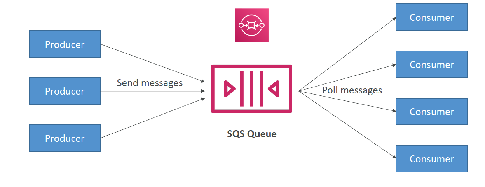

above example, multiple requests to web servers to aks process video, instead of send those request directly to video processing layer, web servers send requests or tasks to SQS, and video processing layer poll the task from SQS, in this way the web servers are **decoupled** from video prcoessing layer. and also, since they are decoupled, video procesing layer can be easily **scaled** (horizontally) by using ASG.

Each consumer process **different** messages

### SNS - Simple Notification Service

+ What if you want to send message to different receivers? SNS sends copy of **ALL** messages to different receivers

+ it does not retain any data, the delivery is not guaranteed 

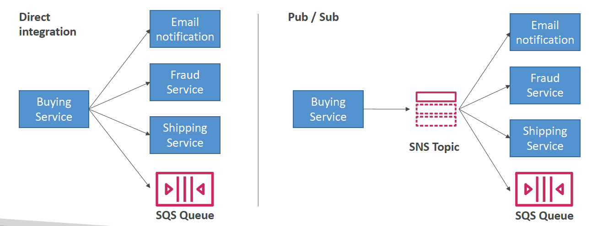

### Kinesis

real-time big data streaming

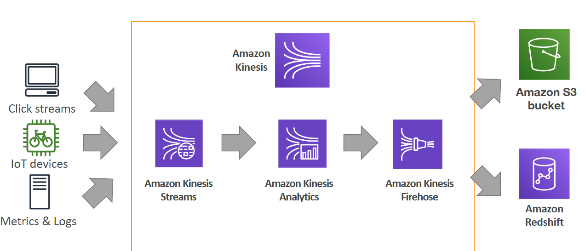

### Amazon MQ

**MQ** : message queue

**proprietary policy**: a policy that is under exclusive legal right fo the inventor or maker. No public

Since  SQS and SNS are "cloud-native" services, and they are using **prorietary** protocols from AWS, which is not public.

When the on-premise wantst to migrate to the could, instead of re-engineering the applciation to use SQS and SNS, we ca use Amazon MQ which is a public protocol

Amazon MQ =. Managed, Apache ActiveMQ

**not serverless**, runs on dedicated machine

**does not scale** as much as SQS/SNS

MQ has both queue feature (**SQS**) and topic feature (SNS)

### Summary

