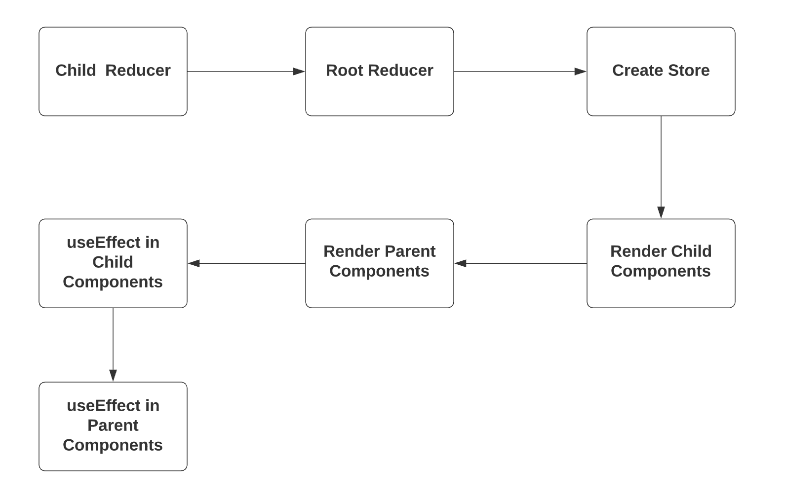

# React.js


## Basics of REACT

#### 1. What is React, why it is popular?

+ it is a **Front End JavaScript** libarary (frame work), it is all about **Modulize**
+ it combines **HTML**, **CSS**, **JS**  together to form different **components** that can be **reused** by change attribute. For example: there is a list of houses information in Zillow, the frame of each list item is same like picture, name, address, price, etc. Then by using **React**, we can make a **ListItem** component which has attributes `picture`, `name`, `address`,  and`price`, we can fetch data from database, and loop through each entry and inject each entry to the **ListItem**
+ Each **Component** is able to update **state** (change data on the web page or update database ) by itself without refresh entire page to reflect changes.

#### 2. Babel

Babel is a **compiler** that convert next generation JavaScript into the version that all browsers can understand.

#### 3. ES6

**ECMAScript** is a [general-purpose programming language](https://en.wikipedia.org/wiki/General-purpose_programming_language), standardised by [Ecma International](https://en.wikipedia.org/wiki/Ecma_International) according to the document [ECMA-262](https://www.ecma-international.org/publications/standards/Ecma-262.htm). It is a [JavaScript](https://en.wikipedia.org/wiki/JavaScript) standard meant to ensure the interoperability of Web pages across different Web browsers.[[2\]](https://en.wikipedia.org/wiki/ECMAScript#cite_note-2) ECMAScript is commonly used for [client-side scripting](https://en.wikipedia.org/wiki/Client-side_scripting) on the [World Wide Web](https://en.wikipedia.org/wiki/World_Wide_Web), and it is increasingly being used for writing server applications and services using [Node.js](https://en.wikipedia.org/wiki/Node.js).

#### 4. JSX

It stands for **JavaScript XML**, it allows us to create element and add element in REACT easier,  it allows us to write HTML elements in JavaScript and place them in the DOM without any `createElement()` and/or `appendChild()`

**Without JSX**

```javascript
const element = document.createElement("h1");
h1.innerHTML="Hello World"
document.body.appendChild(h1);
```

**With JSX**

```JSX
const element = <h1>Hello world</h1>;
ReactDom.render(element, document.getElementById("root"));
```

#### 5. Create React App

`npx create-react-app <app name>`

if we look at `package.json` there is one section in which `start: "react-scripts start"` tells us `npm start` will run the app.

```json
 "scripts": {
    "start": "react-scripts start",
    "build": "react-scripts build",
    "test": "react-scripts test",
    "eject": "react-scripts eject"
  }
```


#### 6. render elements on page

+ render html element in React page, please note that the **elements has to be wrapped** to be a entire element, in the code below, `h1` and `h2` are wrapped up by `div`.
+ apply **.css** file or apply **inline style** attributes
  + directly import **.css** file with the path
  + **inline Style** has to be a javascript object. **Whenever we want to place  JS varaibles in HTML tags, we need to place them in `{}`**  

```jsx
import ReactDOM from "react-dom";
import "./style.css";

const myStyle = {color: "red"};

ReactDOM.render(
  <div>
  	<h1 style={myStyle}>HELLO WORLD!</h1>
    <h2 style={{color: "blue"}}> basics of react</h2>
 	</div>,
document.getElementById("root")
);
```

#### 7. HTML element along with some JS

```jsx
import ReactDOM from "react-dom";
import "./styles.css";
 

const myStyle = {color: "red"};
const curTime = (new Date(2021, 1, 1, 19)).getHours();

let greeting;

if(curTime < 12){
  greeting = "Good Morning";
}else if(curTime < 18){
  greeting = "Good Afternoon";
}else{
  greeting = "Good Night";
}

ReactDOM.render(
  <div>
    <h1 className="heading" style={myStyle}>{greeting}</h1>
  </div>,
  document.getElementById("root")
);
```

#### 8. A simple Component

The core part of **React.js** is **Component**, we create a component by creating a function with capitalized name. Here in order to modulize files, we have three files here: 

+ `Heading.js`, the costomized `Heading` component
+ `App.js`, the basket that collects and combines all components together 
+ `index.js`,  the manager that insert `App` into the page.

```jsx
// in Heading.js file
import React from "react"; // so react can convert jsx into real js

const Heading = () => {
  const myStyle = {color: "red"};
  const curTime = (new Date(2021, 1, 1, 19)).getHours();

  let greeting;

  if(curTime < 12){
    greeting = "Good Morning";
  }else if(curTime < 18){
    greeting = "Good Afternoon";
  }else{
    greeting = "Good Night";
  }
  return <h1>{greeting}</h1>
}

export default Heading;

// in App.js file
import ReactDOM from "react-dom";
import Heading from "./Heading";

const App = () => {
  return(
  	  <div>
    		<Heading />
  		</div>
  )
};


// in index.js file
import ReactDOM from "react-dom";
import App from "./App";

ReactDom.render(<div><App/></div>, document.getElementById("root"));

```

#### 9. Export/Import module in ES6

if `export default ComponentA`, then `import ComponentA from "./Comopnent"`, because there might be **multiple** component in the `Component.js` file, if we use `default` keyword, React.js would know `ComponentA` will be the one to be imported, in this way, we can name `ComponentA` the name we want, such as `import DifferentName from "./Comopnent"`. 

We can use the simpler export if we have only one function/Component in the file:

```jsx
export default function App() {
  return (
    <div className="App">
      <Heading />
    </div>
  );
}
```

While if we want to export/import multiple modules, `export {ComponentA, ComponentB, ComponentC}` then we need to specify which components will be imported, `import {ComponentA, ComponentC} from "./Component"`, here **names have to consistent with names in the export file.**


#### 10. `props`

Let's say we want to render a list of item, each item are similar except for value for each item then we can use `props` of the `Item` component, in the parent component, inject value into `props` and in the `Item` component accept those props.

```jsx
// in the List.js file
const List = ({items}) => { // items is an array of information
    return (
        <div className="List">
        	{items !== null &&
                items.length !== 0 &&
                items.map((item) => {
                    return (
                        <Item
                            name={item.name}
                            src={item.src}
                            phone={item.phone}
                            email={item.email}
                        />
                    );
        	})}
        </div>
    );
}

// in the Item.js file

const Item = (props) => {
    const { name, src, phone, email } = props; // deconstruct
    return (
        <div>
            <h2>{name}</h2>
            
            <p>{phone}</p>
            <p>{email}</p>
        </div>
    );
};
export default Item;
```

#### 11. Arrow Function

let's say given an array, we want to double each element, without arrow function, we might end up with

```js
const nums = [1, 2, 3, 4];

function double(x) {
  return x * 2;
}

const result = nums.map(double);

console.log(result);
```

Let's make it simpler by creating `double` function in side `map` function

```js
const result = nums.map(function double(x) {
  return x * 2;
});
```

Even more simpler by using anonymous function ( no function name):

```js
const result = nums.map(function (x) {
  return x * 2;
});
```

ok, lets remove keyword `function` as well, but add a arrow `=>` to indicate it is a method

```js
const result = nums.map((x) => {
  return x * 2;
});
```

if there is only one input argument, we then can remove pranthese, please note that `()` is needed if there are more than 1 input arguments:

```js
const result = nums.map(x => {
  return x * 2;
});
```

Can we make it even shorter? YES! If there is only one line code in the function, we can even remove curly braces.

```js
const result = nums.map((x) => x * 2);
```

#### 12. Ternary Expression

`condition ? do if true : do if false`

```js
function App() {
  return (
    <div>
      {isLoggedIN ? <h1>Hello</h1> : <Login/>}
    </div>
  );
}
```

What if we do not want to do anything if it is false

`condition && do if true`

```js
function App() {
  return (
    <div>
      {isLoggedIN && <h1>Hello</h1>} // return <h1> if true, and do nothing if false
    </div>
  );
}
```

#### 13. State

This is core concept of React.js, make it simple: how does the UI change when the parameters change. It does not like **imperative programming** ( giving instructions step by step to tell computer how to do), it tells the computer what to do without touch DOM element, **declarative programming**.

Imperative Programming Example: every time we click button, we change the DOM element

```js
function strike() {
  document.getElementById("root").style.textDecoration = "line-through";
}

function strike() {
  document.getElementById("root").style.textDecoration = null;
}
function App() {
  return (
    <div>
      <p>Buy milk</p>
      <button onClick={strike}>Change to strike through</button>
      <button onClick={unStrike}>Change back</button>
    </div>
  );
}


```

Declarative Programming Example, instead of change the property of the DOM each time, here we change the condition `isDone`, **but the code below does not work, why?** since the DOM is rendered, even `isDone` changes after rendering, the element won't reflect the change. DOM elment has to be rendered. **Hook** comes here to be the solution, basically it is a function that hooks into the state of the app and allow us to view and modify it.

```react
var isDone = false;

function strike() {
  isDone = true;
}

function unStrike() {
  isDone = false;
}

function App() {
  return (
    <div>
      <p style={isDone ? { textDecoration: "line-through" } : null}>Buy milk</p>
      <button onClick={strike}>Change to strike through</button>
      <button onClick={unStrike}>Change back</button>
    </div>
  );
}

```

#### 14. `useState`

`const[state, setState] = useState(initialState)`

```react
import React, { useState } from "react";

function App() {
  const [count, setState] = useState(1);
  
  const click = ()=>{
    setState(count + 1);
  }
  return (
    <div className="container">
      <h1>{count}</h1>
      <button onClick={click}>+</button>
    </div>
  );
}
```

#### 15. Handle with form

Here is a simpler way to handle multiple inputs. Note that we use `[name]` to access properties by **key variables**

```react
function App() {
  const [contact, setContact] = useState({});
  const changeHandler = (e) => {
    const { name, value } = e.target; // handle event object out of setContact is better
    setContact({
      ...contact,
      [name]: value // change value of the property based the key variable
    });
  };
  return (
    <div className="container">
      <h1>
        Hello {contact.fName} {contact.lName}
      </h1>
      <p>{contact.email}</p>
      <form>
        <input name="fName" placeholder="First Name" onChange={changeHandler} />
        <input name="lName" placeholder="Last Name" onChange={changeHandler} />
        <input name="email" placeholder="Email" onChange={changeHandler} />
        <button>Submit</button>
      </form>
    </div>
  );
}
```


## Basics of Redux

#### 1. Provider

the ` <Provider>` component makes the Redux `store` availble to any nested components that need to access the Redux Store.

```react
import React from 'react'
import ReactDOM from 'react-dom'
import { Provider } from 'react-redux'

import { App } from './App'
import createStore from './createReduxStore'

const store = createStore()

ReactDOM.render(
  <Provider store={store}>
    <App />
  </Provider>,
  document.getElementById('root')
)

```


#### 16 Allow child element access the variable in the parent

Let's say a simple todo list app below, we add the one item into the todo list when we press "add" button, and delete the item from the todo list if we click the item. We present each item in the child element `ToDoList`, how do we modify `items` in `App` component from `ToDoList` ?

For sure we can modify `items` from `App` by using function `setItems`, so we can pass this function to `ToDoList`, every time the item is clicked, `setItems` is called from `ToDoList`.

```react
const App = () => {
  const [inputText, setText] = useState("");
  const [items, setItems] = useState([]);
	<div className="form">
    <input onChange={handleChange} type="text" value={inputText} />
    <button onClick={setItems([
        ...items,
        inputText
      ])}>
      <span>Add</span>
    </button>
  </div>
  <div>
    <ul>
      {items.map((todoItem, index) => (
        <ToDoItem key={index} id={index} item={todoItem} onChecked={checkItem}/>
      ))}
    </ul>
  </div>
}

// in the ToDoItem.js

const ToDoItem = ({ item, onChecked, id }) => {
  return <li onClick={() => onChecked(id)}>{item}</li>;
  // cannot use return onClick={onChecked(id)} because onChecked(id) will be called
  // immediately when render <li> element instead of waiting for the click event
};

export default ToDoItem;
```

#### 17. React-Redux lifecycle.

+ React component only re-renders when state of variable changes (useState) if this component is not connected to Redux store. 

+ If a component connects to the Redux store, then it will re-render when state of variables changes and state of store changes.

+ Reducers initialized first before store creating.

+ Lifecycle below:

  

  


#### 18. Private Component

Let'say we want to use `<PrivateRoute>` that only can be accessed on conditions, such as logged in user.

For example:  `<PrivateRoute path="/dashboard" component={Dashboard}/>`

In the `PrivateRoute` function , `props` receives all attributes in the `<PrivateRoute/>` such as `path`, `component`. So we deconstruct the `props` into

`{component: Component ,auth: { isAuthenticated, loading }, ...rest}`

where, `...rest` would hold other props other than `component` and `auth`

`render` attibute function accepts a function which returns the component we want to render

Example of `render`:

`<Route path="/home" render={() => <div>Home</div>} />`

```react
<Route
      {...rest}
      render={routeProps => (
        <FadeIn>
          <Component {...routeProps} />
        </FadeIn>
      )}
 />
```

**Complete Code:** 

```react
const PrivateRoute = ({
    component: Component ,
    auth: { isAuthenticated, loading },
    ...rest
}) => {
    return (
        <Route
            {...rest}
            render={(props) =>
                loading ? (
                    <Spinner />
                ) : isAuthenticated ? (
                    <Component {...props} />
                ) : (
                    <Redirect to="/login" />
                )
            }
        />
    );
};

PrivateRoute.propTypes = {
    auth: PropTypes.object.isRequired,
};

const mapStateToProps = (state) => ({
    auth: state.auth,
});
export default connect(mapStateToProps)(PrivateRoute);

```


## Tricky Stuff

#### 1. `filter` vs `map` vs `reduce` vs `find` vs `findIndex`

+ `filter`, just like what the name indicates, it filter some element out based on the criteria. This function **accepts a function** which check each element in the array against something, if it is true, the element is kept in the new array, otherwise, discard. It **returns a** **new array**

  ```js
  const number = [1, 2, 3, 4];
  
  const filter = number.filter(num => num % 2 === 0);
  
  console.log(filter);
  //output; 
  [2, 4]
  ```

+ `map` accepts a **function**, and **return** a new array by doing something with each element in the array

  ```js
  const number = [1, 2, 3, 4]
  
  const new_arr = number.map((num) => {
    return num *2;
  });
  
  console.log(new_arr);
  // output:
  [2, 4, 6, 8]
  ```

+ `reduce`, just like accumulator, add each element up and **return a new number**, it **reduce** an array into a single value

  ```js
  const number = [1, 2, 3, 4];
  
  const reduce = number.reduce((accumulator, num) =>{
    return accumulator += num;
  })
  
  console.log(reduce);
  //output: 
  10
  ```

+ `find`, finds the first match in an array, the difference with `filter` is that `find` **stops** once find a match.

  ```js
  const number = [1, 2, 3, 4];
  
  const find = number.find((num) => {
    return num % 2 === 0;
  });
  
  console.log(find);
  //output
  2
  ```

+ `findIndex`, however finds the index of the first match.

## Troubleshooting:

#### 1. Error: `react-scripts not found`  after `npm install`:

* **option 1**: remove **node_modules**  and **package-lock.json** by ` rm -rf node_modules pakcage-lock.json`. Then reinstall by `npm install`
* **option 2** : check if you have **react-scripts** installed, if not `npm install react-scripts`

#### 2. Error: listen EADDRINUSE: address already in use :::5000

​	this is because `nodemon` restart the server before react kill the process. In this case, we need to make `nodemon` kill process:

1. Install the `kill-port` node package as a dev dependency: `npm install kill-port --save-dev`

2. Create a `nodemon.json` file in the root of your project, containing (replace 18000 with your port, eg 3000), Please __note__  that  below example is a global config, you can place this config into` package.json`

   ```json
   { "events": {	
       		"restart": "kill-port 18000",
               "crash": "kill-port 18000"     
               },     
    "delay": "1500"  
   }
   ```

   

   

3. Then, in your `package.json` file, have something like this:

   `"scripts": {    "start-dev": "nodemon app.js",  },`

## Note:

### 1. `exact` in `React-router-dom`

In this example, nothing really. The `exact` param comes into play when you have multiple paths that have similar names:

For example, imagine we had a `Users` component that displayed a list of users. We also have a `CreateUser` component that is used to create users. The url for `CreateUsers` should be nested under `Users`. So our setup could look something like this:

```js
<Switch>
  <Route path="/users" component={Users} />
  <Route path="/users/create" component={CreateUser} />
</Switch>
```

Now the problem here, when we go to `http://app.com/users` the router will go through all of our defined routes and return the FIRST match it finds. So in this case, it would find the `Users` route first and then return it. All good.

But, if we went to `http://app.com/users/create`, it would again go through all of our defined routes and return the FIRST match it finds. React router does partial matching, so `/users` partially matches `/users/create`, so it would incorrectly return the `Users` route again!

The `exact` param **disables the partial matching** for a route and makes sure that it only returns the route if the path is an EXACT match to the current url.

So in this case, we should add `exact` to our `Users` route so that it will only match on `/users`:

```js
<Switch>
  <Route exact path="/users" component={Users} />
  <Route path="/users/create" component={CreateUser} />
</Switch>
```

### 2. `return` in `Array.map()` doesn't return anything

```javascript
alerts.map((alert) => {
			return (
				<div key={alert.id} className={`alert alert-${alert.type}`}>
					{alert.msg}
				</div>
			);
		});
```

Please note that the `return` inside the `map` function would just return `<div>...</div>` element locally, we need to add another `return` before `map()` to return everything inside the `map()` globally!

```javascript
return alerts.map((alert) => {
			return (
				<div key={alert.id} className={`alert alert-${alert.type}`}>
					{alert.msg}
				</div>
			);
		});
```

### 3. How does React/React-redux update component when State/Store changes

+ **React**: it will re-render every time, state changes, such as when we use `useState` hook:

  ```js
  const {counter, setCounter} = useState(10);
  // when counter changes (might be caused by an event)
  // react will render the DOM
  ```

  **<u>Be Careful !!!!        infinite loop</u>**

  what happens in below code: 

  `setCounter()` increments `counter` by 1 

  **-->**  react compare the current value of `counter` (1) against the previous value of `counter` (0)

   **-->** react detects the difference and re-render the component

  **-->** `setCounter` will be called again in the second round, `counter` becomes 2  

  **-->** react re-render again **-->** `setCounter` is revoked again in the third round, counter becomes 3 

  **-->** infinite loop

  <u>That is why normally `setState` function is placed inside `event` call back, so that `setState` can not be access in the following round if event does not occur</u> 

 ```js
const myComponent = () = {
    const {counter, setCounter} = useState(0);
	setCounter(counter ++);
	return (
    ...
    )
}
 ```

+ `useEffect` , it is called after the each render if no **dependency** array is defined. If an empty **dependency** array is provided, `useEffect` is only revoked after the first render.
+ `connect`, the `connect` function generates a wrapper component that subscribes to the store. When an action is dispatched, the wrapper component's callback is notified. It then runs `mapStateToProps` function and **shallow-compares** the result object at this moment against the previous result object, if results are different, then it passes the results to the component as props. <u>In one sentence, connect enables the component access store, compare states and update component by itself.</u>

### 4. How to fetch data to the component? Why component does not reflect update when update store from `useEffect` ?

**Key point** is that the state in the store might not be saved immediately or saved fast enough before rest of code runs

```js
import {connect} from "react-redux";


const myComponent = ({ file:{files}, getFiles }) =>{
    
    useEffect(() ={
        getFiles();
        const options = [];
        files.forEach(file => options.push({file.name : file})) // some other operation such as refine array
    }, [])
    return (
    	<Select options={files} />
        )
    )
}

const mapStateToProps = state =>({
    file: state.file
})
export default connect(mapStateToProps, {getFiles})(myComponent);
```

1. before mount and render `myComponent`, `file.files=[]`;
2. after the first render, `getFiles()` inside the `useEffect` is called, dispatch `action` to`reducer` to update `file` state in the `store`
3. please **<u>note</u>** that `action` -> `reducer` may take a while which might be done after rest of the code inside the `useEffect`, that results in empty `options` . **<u>This not what we want</u>**
4. finally, `file` is updated `file.files =[...]` , due to `connect`, react re-render the component, `myComponent` in our case, **however** `useEffect()` will **NOT** be called this time since an empty array is provided. `options` keeps empty.
5. No change reflected on the `<Select>` part.


##### Solution 1: 

```js
const myComponent = ({ file:{files}, getFiles }) =>{
    
    useEffect(() ={
        getFiles();
    }, [])
    return (
    	{file.files.length !== 0 && file.files.map( file => <p> file.content <p/>)}
        )
    )
}

const mapStateToProps = state =>({
    file: state.file
})
```

We will see we display data directly instead of doing some operation inside the `useEffect` which cannot be  accessed in the second round when `react` detects the update in `file.files`. what happens listed below:

1. before mount and render `myComponent`, `file.files=[]`;
2. after the first render, `getFiles()` inside the `useEffect` is called, dispatch `action` to`reducer` to update `file` state in the `store`
3. during `file` in the `store` updating, before it finishes updating, the code `return (...)` runs, component is **empty** at this moment (for very short period of time)
4. once `file` in the `store` finishes,  `file.files =[...]`, updating and `react` detects the change, `react` re-render the component, this time `useEffect()` is not reached
5. due to `file.files =[...]`, component now is not empty

<u>**but what if we do want to do some manipulation with the data before displaying them**?</u>

##### Solution 2

```js
import {connect} from "react-redux";


const myComponent = ({ file:{files}, getFiles }) =>{
    
    useEffect(() ={
        getFiles();
    }, []);
	const options = [];
     files.forEach(file => options.push({file.name : file}))
    return (
    	<Select options={files} />
        )
    )
}

const mapStateToProps = state =>({
    file: state.file
})
export default connect(mapStateToProps, {getFiles})(myComponent);
```

we can move the code that manipulates arrays out of `useEffect`, in this case, `const options = [];
     files.forEach(file => options.push({file.name : file}))` will be reached in the second round after `state` finishes updating and `react` detects the change. Please **Note** that, we cannot use `useState` in this case, or state will be changed, re-render occurs again then state will be changed again ... infinite loop.


##### Solution 3:

```js
import {connect} from "react-redux";


const myComponent = ({ file:{files}, getFiles }) =>{
    
    useEffect(() ={
        getFiles();
        const options = [];
        files.forEach(file => options.push({file.name : file})) // some other operation such as refine array
    }, [files.length])
    return (
    	<Select options={files} />
        )
    )
}

const mapStateToProps = state =>({
    file: state.file
})
export default connect(mapStateToProps, {getFiles})(myComponent);
```

add `files.length` as the dependency, every time the length changes, `useEffect` is revoked.

1. before mount and render `myComponent`, `file.files=[]`;
2. after the first render, `getFiles()` inside the `useEffect` is called, dispatch `action` to`reducer` to update `file` state in the `store`
3. in the first round, `const options = [];
           files.forEach(file => options.push({file.name : file}))` is reached before `store` finishes the update, there would be no option in the `<Select>`
4. once `store` finishes updating, re-render, `useEffect` called again,  `file.files = [...]` ( this is the result from the first round) even second round updating is not finished. Now there are option in the `<Select>`
5. once the second round updating finishes, no re-render any more, since `files.length `  is still the same as the result of the first round

### 5. Order of the functions run 

```js
console.log(" i am running first, but child's functions run earlier if there is any");
console.log("i will  not be called if re-render");
const myComponent = ({ file:{files}, getFiles }) =>{
    
    useEffect(() ={
        conosole.log("i am the third one to run");
        getFiles();
        const options = [];
        files.forEach(file => options.push({file.name : file})) 
    }, []);

    console.log("i am running secondly, before hooks run");
    return (
    	<Select options={files} />
        )
    )
}

const mapStateToProps = state =>({
    file: state.file
})
```

### 6. Understand `useState`(needs to be completed!!!)

```js
export default function App() { 
  let text = "";
  console.log("render .......");
  const changeHandler = (e) => {
    console.log(e.target.value);
    console.log(e.target.defaultValue)
    text = e.target.value;
  };
  return (
    <div className="App">
      <input type="text" value={text} onChange={changeHandler} />
    </div>
  );
}
```

when we type in "a", console result is 

```
render ....... 

a 

"" 
```

Here, with uncontorlled element, `value` attribute will be overrided by whatever typed in the input. To make controlled element work, React brings another attribute `defaultValue`,

**<u>findings :</u>**

+ which means it does not re-render.
+ the `value` in the `e.target.value` is not the same with `value` attribute in the `input` tag

```js
export default function App() {
  const [text, setText] = useState("");
  console.log("render .......");
  const changeHandler = (e) => setText(e.target.value);
  return (
    <div className="App">
      <input type="text" value={text} onChange={changeHandler} />
    </div>
  );
}
```

**<u>procedure</u>**: type in letter --> trigger `changeHandler` --> set `text = e.target.value` -->  due to `useState` is used, once `text` updates, `react` re-renders --> `value` attribute in the `input` tag updates to the latest value --> we see what we typed shows in the `input` area

### 7. `useMemo`

Let's look at the example below first:

```js
export default function App() {
  const [text, setText] = useState("");

  const [word, setState] = useState("");

  const changeHandler = (e) => setText(e.target.value);

  const addItem = () => setState(text);

  const veryHeavyCalculation = () => {
    console.log("veryHeavyCalculation is triggered");
    return word + "result";
  };

  // const results = useMemo(veryHeavyCalculation, [word]);
  const results = veryHeavyCalculation();

  console.log("rendering .....");
  return (
    <Fragment>
      <input type="text" value={text} onChange={changeHandler} />
      <button onClick={addItem}> Add Item </button>
      <p>{results}</p>
    </Fragment>
  );
}

```

The idea of this code is that, user can add word into `<p></p>`;

Please note that contents in  `<p></p>` does not necessarily change unless the button is clicked 

**However** **Every time** a letter is typed in to the input, `text` changes, `react` re-renders, `const results = veryHeavyCalculation();` is called  **again and again**. 

**output**:

```
veryHeavyCalculation is triggered 
rendering ..... 
veryHeavyCalculation is triggered 
rendering ..... 
veryHeavyCalculation is triggered 
rendering ..... 
...
```

It wont be a problem if `veryHeavyCalculation` is light weighted, however, things change dramatically, if `veryHeavyCalculatioin` is **heavy** like what its name indicates. Lets see what happens if we utilize `useMemo` :

```js
export default function App() {
  const [text, setText] = useState("");

  const [word, setState] = useState("");

  const changeHandler = (e) => setText(e.target.value);

  const addItem = () => setState(text);

  const veryHeavyCalculation = () => {
    console.log("veryHeavyCalculation is triggered");
    return word + "result";
  };

  const results = useMemo(veryHeavyCalculation, [word]);
  // const results = veryHeavyCalculation();

  console.log("rendering .....");
  return (
    <Fragment>
      <input type="text" value={text} onChange={changeHandler} />
      <button onClick={addItem}> Add Item </button>
      <p>{results}</p>
    </Fragment>
  );
}


```

**output**:

```
rendering ..... 
rendering ..... 
rendering ..... 
rendering ..... 
...
```

**conclusion**

`useMemo` memoizes value, prevent unnecessary re-render. Please **note** that, `useMemo` does more work behind, do not overuse it unless the memoized value comes from heavy computations.

### 8. `useCallback`

lets look at the example below

```js
export default function App() {
  const [value1, setValue1] = useState(0);

  const [value2, setValue2] = useState(10);

  const add1 = () => setValue1(value1 + 1);

  const add2 = () => setValue2(value2 + 2);

  const veryHeavyCalculation = () => {
    console.log("veryHeavyCalculation is triggered");
    return value2 * 1.1;
  };

  const another = veryHeavyCalculation();

  console.log("rendering .....");
  return (
    <Fragment>
      <p>value1 is {value1}</p>
      <button onClick={add1}> Add Value1 </button>
      <p>another value is {another}</p>
      <button onClick={add2}> Add another value </button>
    </Fragment>
  );
}

```

We notice that `another value` is independent with `value1`, every time we change the value of `value1`, it is not necessary for `another value` to change, right?

but **output**:

```
veryHeavyCalculation is triggered 
rendering ..... 
veryHeavyCalculation is triggered 
rendering ..... 
veryHeavyCalculation is triggered 
rendering ..... 
```

**solution**:

```js
export default function App() {
  const [value1, setValue1] = useState(0);

  const [value2, setValue2] = useState(10);

  const add1 = () => setValue1(value1 + 1);

  const add2 = () => setValue2(value2 + 2);

  const veryHeavyCalculation = () => {
    console.log("veryHeavyCalculation is triggered");
    return value2 * 1.1;
  };

  const another = useCallback(veryHeavyCalculation, [value2]);

  console.log("rendering .....");
  return (
    <Fragment>
      <p>value1 is {value1}</p>
      <button onClick={add1}> Add Value1 </button>
      <p>another value is {another}</p>
      <button onClick={add2}> Add another value </button>
    </Fragment>
  );
}

```

**conclusion**:

similar with `useMemo` to memoizes the value to prevent unnecessary renders, `useCallback` memoizes functions


### 9.`useRef` : 

**<u>it does not hold state, so it will NOT re-render</u>**

**Execution Order of `useEffect`**:

```JS
const Test = () => {
  const [user, setUser] = useState({ name: "Yang", weight: 165 });
    
  const usePrevious = (value) => {
    console.log(" Step-1");
      
    const ref = useRef();
    useEffect(() => {
      ref.current = value;
      console.log(" Step-6");
      console.log(ref.current);
    }, [value]);

    console.log(" Step-2");
    console.log(ref.current);
    return ref.current;
  };

  const someother = () => {
    console.log("step-4");
    useEffect(() => {
      console.log(" Step-8");
    });
    return 0;
  };

  const previousUser = usePrevious(user);

  console.log(" Step-3");
  console.log(previousUser);

  useEffect(() => {
    console.log("inside effect Step-7");
    console.log(previousUser);
    console.log(user);
    if (!isEqual(previousUser, user)) {
      console.log("Effect is running");
    }
  });
  const zero = someother();
  console.log(" Step-5  ");

  const handler = () => {
    setUser((prev) => {
      return {
        ...prev,
        weight: Math.random() >= 0.5 ? prev.weight + 1 : prev.weight
      };
    });
  };

  return (
    <>
      <p>Current weight : {user.weight}</p>
      {/* <p>
        <b>refFromUseRef</b> value: {refFromUseRef.current}
      </p> */}
      <p>
        <b>previous weight </b>:
        {typeof previousUser !== "undefined" && previousUser.weight}
      </p>

      <button onClick={handler}>Cause re-render</button>
    </>
  );
};
```

**output of the first render**

```console
 Step-1 
 Step-2 
Object {name: "Yang", weight: 165}
 Step-3 
Object {name: "Yang", weight: 165}
step-4 
 Step-5   
 Step-6 
Object {name: "Yang", weight: 166}
inside effect Step-7 
Object {name: "Yang", weight: 165}
Object {name: "Yang", weight: 166}
Effect is running 
 Step-8 
```

**conclusion**:  

execute all regular functions (not hooks) first in the order of they are called, then hooks in the order of they are called

### 10. Deep Comparison

```js
const Test = () => {
  const [user, setUser] = useState({ name: "Yang", weight: 165 });

    // use container to avoid the case that undefined !== null or []
  const usePrevious = (value, container) => {
    console.log(" Step-1");
    const ref = useRef();

    useEffect(() => {
      ref.current = value; // previousUser does not change
      console.log(" Step-5");
      console.log(ref.current);
    }, [value]);

    console.log(" Step-2");
    console.log(ref.current);
    return ref.current;
  };

  const previousUser = usePrevious(user);

  console.log(" Step-3");
  console.log(previousUser);

  useEffect(() => {
    console.log("inside effect Step-6");
    console.log(previousUser);
    console.log(user);
    if (!isEqual(previousUser, user)) {
      console.log("Effect is running");
    }
  });
 
  console.log(" Step-4");
  
  const handler = () => {
    setUser((prev) => {
      return {
        ...prev,
        weight: Math.random() >= 0.5 ? prev.weight + 1 : prev.weight
      };
    });
  };

  return (
    <>
      <p>Current weight : {user.weight}</p>
      {/* <p>
        <b>refFromUseRef</b> value: {refFromUseRef.current}
      </p> */}
      <p>
        <b>previous weight </b>:
        {typeof previousUser !== "undefined" && previousUser.weight}
      </p>

      <button onClick={handler}>Cause re-render</button>
    </>
  );
};

```

**part of output when weight increases to 166**:

```
 Step-5 
Object {name: "Yang", weight: 166}
inside effect Step-6 
Object {name: "Yang", weight: 165}
Object {name: "Yang", weight: 166}
```

**first of all**, `let ref = obj1; cur = ref;`, here `cur` points to `obj1` instead of pointing to `ref` itself.

```js
const Test = () => {
  const obj1 = {
    name: "hello"
  };
  const obj2 = {
    name: "world"
  };

  let cur = {};
  let ref = obj1; // ref has the reference to obj1
  cur = ref; // cur has the reference to obj1 instead of reference to ref
  console.log(cur); // {name: "hello"}
  ref = obj2; // now ref points to obj2, cur still points obj1
  console.log(cur); // {name: "hello"}
  return <p>this is testing</p>;
};
```

Now, we know that in `usePrevious`, when `ref.current = value;`, `previousUser` does not change. In this way, update of `previousUser` is always delayed.

`useRef` does not change even we re-run `const ref = useReft()` when re-render.

Basically, in `usePrevious`, it returns old value before running `useEffect `(the one inside `usePrevious`) which update `ref`

Example: `ref.current = 165`, state change, weight becomes 165, --> re-render -->`usePrevious` return current `ref` which is 165 

--> run rest of nomal code ---> run  `useEffect `(the one inside `usePrevious`) update `ref`, now `ref.current = 166`, but it does not return to `previousUser`, `previousUser` is still 165 -->  `useEffect `(the one inside `Test`) runs, compare `previousUser`(165) against current value 166.

### 11. Function inside vs outside `useEffect`

+ **bad example (confusion as well):**

```js
const State = () => {
  const hello = () => console.log("hello");

  useEffect(()=>{
    hello();
  }, [hello]);
  return (
    <Fragment>
      <p> current value is {state}</p>
      <button onClick={() => setState((prev) => prev + 1)}> Add </button>
    </Fragment>
  );
};
```

Based on what I search online and look up the docs, `hello()` will be called infinitely due to new **object** of `hello` function is created every time re-render. **However** based on my test, `hello()` is only called once.

**any way** for better practice:

```js
  const hello = useCallback(() => {
    console.log("hello");
  }, []);
```

### 10. Deploy a MERN app on Heroku

+ install `heroku`, --> `heroku login` --> `heroku create` --> `heroku git:remote -a <domain name>` now a `heroku` remote is added into the directory

+ add `.env` into `.gitignore`, go to `heroku` **dashboard** --> **settings** --> section **Config Vars**, add **key**s and  **value**s from `.env` into this section

+ **add right port**, we use a certain port for development, `heroku` will assign a port to the app, use code like  `const PORT = process.env.PORT || 5000;`

+ **specify node version**: add `"engines":{ "node": <version> }` into **backend** `package.json` below `"dependencies"`

+ **remove `nodemon`**: remove `nodemon` from `dependencies` if it is there

+ **build react app on` heroku`**: we need to build the react app into optimized version for production by using `npm run build`, after that `/client/build/index.html` will be generated, the `index.html` is the gateway for the react app. We can either `build` locally and push into `heroku` or write a script to `build` after pushing the app into heroku

  `heroku-postbuild: "NPM_CONFIG_PRODUCTION=false npm install --prefix client && npm run build --prefix client"`, 

+ **add a Procfile**: add a file named `Procfile` that specifies how `heroku` runs the app. Write `web: node <server file name>` into the file. If `Procfile` is not specified, ` heroku` will run `start` script defined inside **backend** `package.json/scripts`. So make sure `"start"` command is defined in `package.json` file.

+ **config server to run react app on `heroku`**,  we configured how to run `server.js` , how to `build` react app on heroku, now we are going to configure how to connect the react APP to the backend. 

  add code below into `server.js`

  ```js
  if (process.env.NODE_ENV === "production") {
  	app.use(express.static("client/build")); // config static folder
  	app.get("*", (req, res) => { // connect front end to backend
  		res.sendFile(path.resolve(__dirname, "client", "build", "index.html"));
  	});
  }
  ```

  

### 12 . Select Component

+ install **`react-select`**

+ ```js
  import select from "react-select";
  
  const Component = () => {
      
      // initialState is {} if it is a single select
      const[selected, setSelected] = useState([]);
      
      onSubmit = (e) => {
          e.preventDefault();
          //...submit
      }
      
      return 
      <form onSubmit={onSubmit}>
          <Select
      		style={{
                     menuPortal: (base) => ({
                         ...base,
                         zIndex: 9999,
                     }),
  			}}
  			menuPortalTarget={document.body}
  			closeMenuOnSelect={false}
      		name="select"
      		isMulti
      		options={toBeSelected}
    		value={selected}
      		onChange={(selected) => setSelected(selected)}
      	>
          </Select>
      </form>
      
  }
  ```
  
  the format of options is `{value:..., label:... }`, normally, `value` is the id of the item, `value` need to be extract from the form data in the backend.
  
  ```
  style={{
                     menuPortal: (base) => ({
                         ...base,
                         zIndex: 9999,
                     }),
  			}}
  			menuPortalTarget={document.body}
  ```
  
  is used to avoid the drop down menu overlapping by other components
  
  

### 13. TinyMCE in React

+ install  `@tinymce/tinymce-react`

```js
import { Editor } from "@tinymce/tinymce-react";

const Component = () => {
    const setup = {
		height: 500,
		menubar: false,
		plugins: [
			"advlist autolink lists link image charmap print preview anchor",
			"searchreplace visualblocks code fullscreen",
			"insertdatetime media table paste code help wordcount",
		],
		toolbar:
			"undo redo | formatselect | bold italic backcolor | \
          alignleft aligncenter alignright alignjustify | \
          bullist numlist outdent indent | removeformat | help",
		textpattern_patterns: [
			{ start: "*", end: "*", format: "italic" },
			{ start: "**", end: "**", format: "bold" },
			{ start: "__", end: "__", format: "bold" },
			{ start: "`", end: "`", format: "code" },
			{ start: "#", format: "h1" },
			{ start: "##", format: "h2" },
			{ start: "###", format: "h3" },
			{ start: "####", format: "h4" },
			{ start: "#####", format: "h5" },
			{ start: "######", format: "h6" },
			{ start: "1. ", cmd: "InsertOrderedList" },
			{ start: "* ", cmd: "InsertUnorderedList" },
			{ start: "- ", cmd: "InsertUnorderedList" },
		],
	};
	
	const[tinyContent, setContent] = useState("");

    const editorHandler = (content, editor) => {
        setContent(content)
    }
	return <form onSubmit={onSubmit}>
        		<Editor
					apiKey={apiKey}
					init={setup}
					value={tinyContent}	
					onEditorChange={editorHandler}
				/>
        	</form>
}

```

use `onEditorChange` to get **content** of the editor.


### 14. Highlight code block in React.js

+ we will use **highlight.js**, `npm install highlight.js`
+ use code:

```js
import React, { useEffect } from "react";
import hljs from "highlight.js";
import "highlight.js/styles/github.css";

const Highlight = () => {
  useEffect(() => {
    // Prism.highlightAll();
    updateCodeSyntaxHighlighting();
  });

  const updateCodeSyntaxHighlighting = () => {
    document.querySelectorAll("pre code").forEach((block) => {
      hljs.highlightBlock(block);
    });
  };
  const code = `
  lets see the code below:
  <pre>
  <code>
  const MemoChild = ({ value, name }) => {
    const veryHeavyCalculation = () => {
      console.log("veryHeavyCalculation is triggered");
      return "result ---   " + value;
    };
    const result = veryHeavyCalculation();
    console.log("rendering " + name);
    return <p>{result}</p>;
  };
  </pre>
  </code>
  When we click the "component 1 event" button, counter1 increments by 1, React re-renders MemoCompo .

  `;

  return (
    <div
      dangerouslySetInnerHTML={{
        __html: code
      }}
    />
  );
};

```

### 14. Syntax Highlighting Code Snippets

We are going to use **highlight.js** here.

+ go into the react app folder, install **hightlight.js** `npm install hightlight.js`
+ sample code:

```js
import React, { Fragment, useEffect } from "react";
import hljs from "highlight.js";
import "highlight.js/styles/atom-one-dark-reasonable.css";

const PostContent = ({ content }) => {
	useEffect(() => {
		updateCodeSyntaxHighlighting();
	});

	const updateCodeSyntaxHighlighting = () => {
		document.querySelectorAll("pre code").forEach((block) => {
			hljs.highlightBlock(block);
		});
	};

	return (
		<Fragment>
			<div className="row post-content">
				{content !== null && (
					<div
						className="main-body"
						dangerouslySetInnerHTML={{
							__html: content,
						}}
					/>
				)}
			</div>
		</Fragment>
	);
};

export default PostContent;
```

`useEffect` here to ensure code block is re-formatted every time page is re-loaded

`dangerouslySetInnerHTML={{__html:content}}` is used to make app to render html tags. Please make sure sanitize **content** before being written into the database for security purpose.

`updateCodeSyntaxHightlighting` is to search all code samples and format them. 