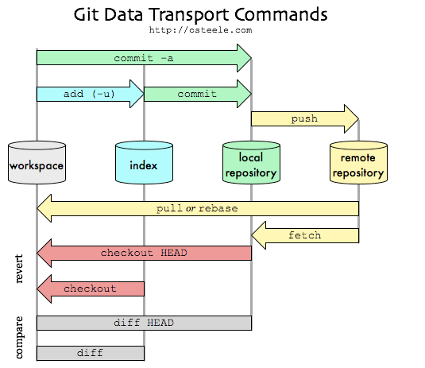
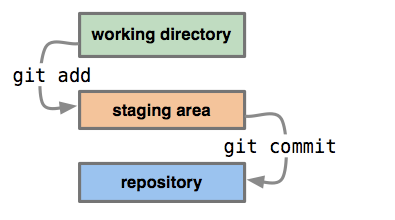

# git

## Intro





1.   Edit git config by editor
	
	+ Set Default editor: `git config --global core.editor "code --wait"`, here `--wait` means git terminal waits when using editor
	
	+ `git config --global -e`
	
2. **view staged files**

   `git ls-rm`

3. **see diff between remote and local**

   + `git diff` compare working area to index
   + `git diff --staged` compare stage area to repo
   + `git diff HEAD` compare working area to repo

   

4. Use VSCode for diff tools

   + `git config --global diff.tool vscode`
     + `git config --global difftool.vscode.cmd "code --wait --diff $LOCAL $REMOTE"`

5. **undo git add**

   `git reset /  get reset <file name>`

6. **undo the last commit**

  + `git reset --soft HEAD~1` : Reset will rewind your current HEAD branch to the specified revision. In our example above, we'd like to return to the one before the current revision - effectively making our last commit undone.
  + `git reset --hard HEAD~1`: If you don't want to keep these changes, simply use the --hard flag. 

4. **remove files or folders from remote after updating `.gitignore`**

   + `git rm -r --cached <some-directory>` remove files from index (staging area)
   + `git add -A`
   + `git commit -m <message>`
   + `git push origin master`

5. **work with previous commit**

   + `git check <commit_id>`      // change the code into the specified commit, but it is in "detached Head" which means no branch to hold it
   + `git check -b <new_brach_name>`    // create a new branch to retain the commit
   + `git branch <branch_name> <commit_id>`     //Or just create a new brach to retain the specific commit 
   + `git check - `     // go back to latest commit
   + `git merge <new_branch_name>`      // merge the change in detached head to master
   + <u>if I want to make the previous commit as a newest commit:</u>
     + `git checkout master`      //master is the branch that the previous commit will be merged to 
     + `git cherry-pick <commit_id>` 
       before cherry-pick :   --A--B--C--D    master
       			    |--E--F--G
       after cherry-pick E :  --A--B--C--D--E   master
       			  |--E--F--G

6. **ignore `Icon?` File**

  open `.gitignore` with `vim`, insert `Icon[^M]` by `Icon[` followed by `ctrl` `v` and `enter` then `]`.

7. ### Merge local work with remote repo

   

   ```shell
   git checkout master
   git fetch <remote>
   
   # Merge remote/master
   git merge remote/master
   
   # Or rebase local commits on top instead
   git rebase remote/master
   
   # Push the results
   git push remote master
   ```

8. ### update credential 

   + **solution1 **: [page](https://docs.github.com/en/get-started/getting-started-with-git/updating-credentials-from-the-macos-keychain), `git config --global credential.helper osxkeychain` to let mac know you want to use credential helper to manage key chain, the prompt will show up when you push next time, type in the token as password 
   
   + **solution 2**: [page](https://stackoverflow.com/questions/20195304/how-do-i-update-the-password-for-git), `git config --global --unset user.password`, then a prompt will show up
   
     

